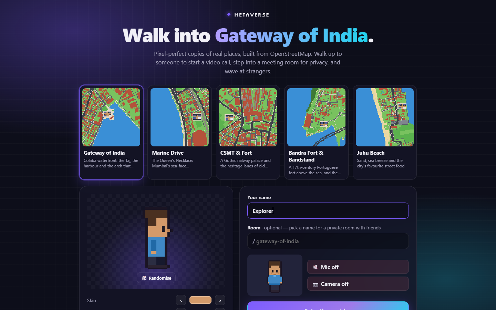
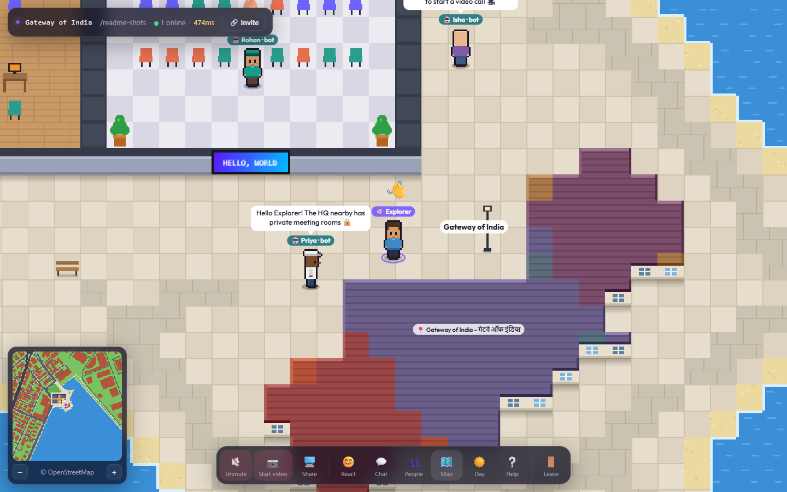
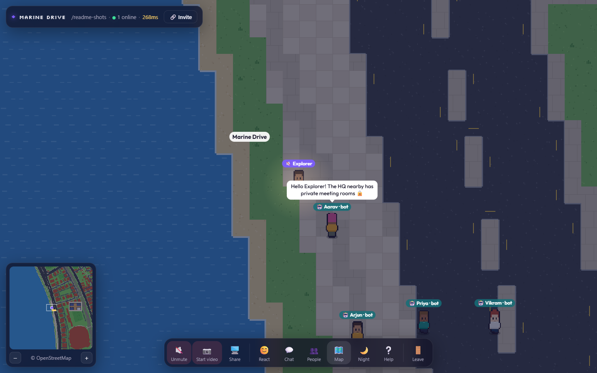
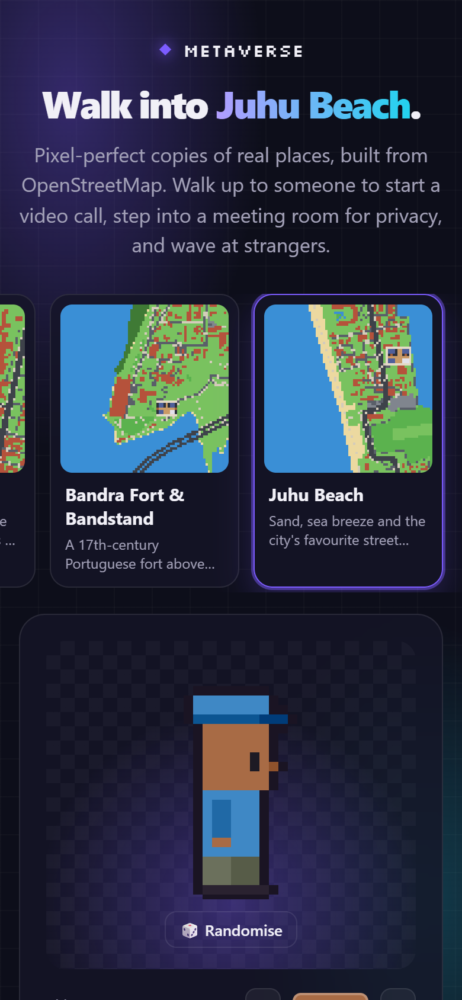
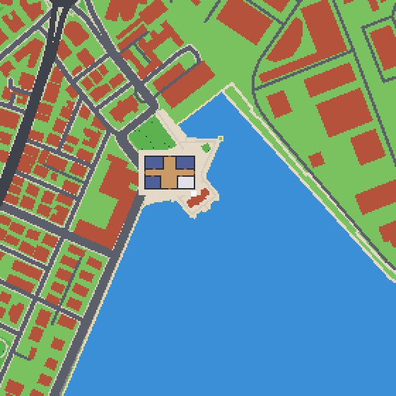
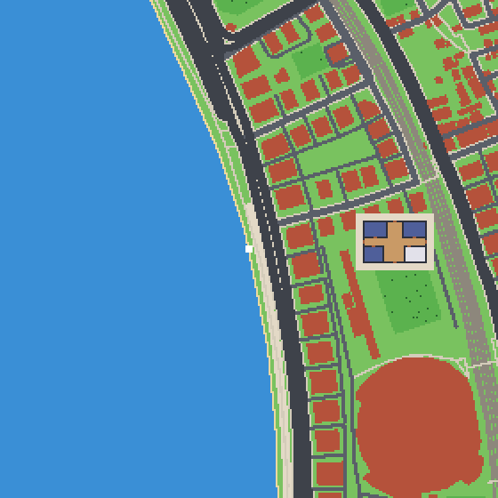
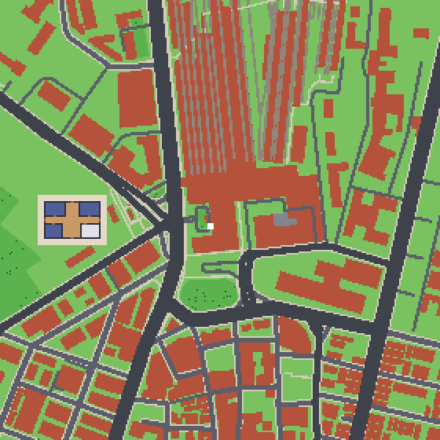
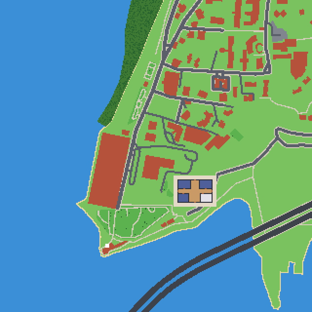
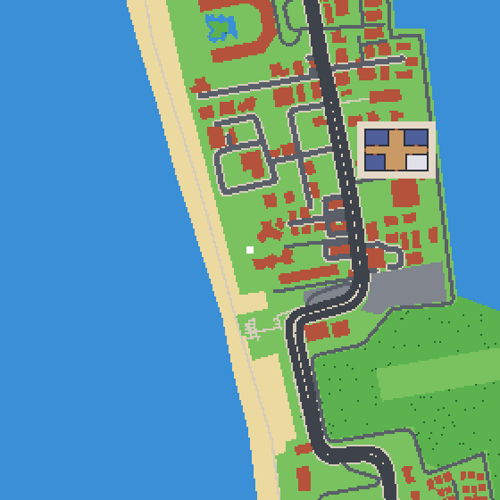

# ◆ metaverse

**▶ Live demo: https://metaverse-mzu0.onrender.com** · bring a friend, or say hi to the guide bots

Walk around **real places in Mumbai**, rebuilt as pixel art from OpenStreetMap. When you walk up to someone, a **video call** starts on its own, and their voice fades as you walk away. Step into a meeting room for a private chat, or wave at people as you pass. It's in the same spirit as Gather and ZEP, but every street, building and coastline here is real.





| Marine Drive after dark | On a phone |
| :-: | :-: |
|  |  |

## The spots

| | | |
| :-: | :-: | :-: |
| <br>**Gateway of India**<br>Colaba waterfront & the harbour | <br>**Marine Drive**<br>The Queen's Necklace | <br>**CSMT & Fort**<br>Gothic station, old Bombay lanes |
| <br>**Bandra Fort & Bandstand**<br>Portuguese fort above the sea | <br>**Juhu Beach**<br>Sand, sea breeze, street food | |

Each map is about 700 m × 700 m of the real city at 2.5 m per tile. You can add your own with one command (see [Map import](#map-import)).

## Features

- 🗺️ **Real-world maps.** Roads, buildings, parks, the sea, piers, railways, trees, street lamps and place names come from OpenStreetMap and are turned into a walkable pixel-art world. Players spawn at the landmark, and an HQ office with meeting rooms is placed on the clearest ground nearby.
- 🎥 **Proximity video and voice.** WebRTC calls connect when players are within a few tiles and drop when they walk away. Voices fade with distance.
- 🔒 **Private rooms.** Inside a meeting room, only people in that room can hear each other, whatever the distance. Walls block sound.
- 🤖 **Guide bots.** Clearly labelled bot avatars wander near each landmark, greet visitors by name and share tips, so a solo visitor never lands in an empty world. Bots are never part of calls.
- 🖥️ **Screen sharing**, speaking indicators, and click-to-spotlight on any video tile.
- 🧭 **Click-to-walk** using A* pathfinding. You can also click the minimap to travel, or use "Walk to" on anyone in the People list.
- 💬 **Chat** to everyone or only to people nearby, with speech bubbles over avatars, emotes (`1`–`6`) and a status line.
- 🧑‍🎨 **Avatar creator.** Every sprite is drawn in code, with no image assets.
- 🌙 **Live day/night cycle** that follows your local clock, with street lamps that light up after dark.
- 🛡️ **Server-checked movement.** The server checks speed and collisions, rate-limits chat, and enforces room caps.
- 🔗 **Shareable rooms.** `?spot=marine-drive&space=team-standup` gives a group its own private instance of a spot.
- 📱 **Phone friendly.** The page is a single 87 KB gzipped file with a built-in loading screen, and you can tap anywhere to walk.

## How it works

- **OpenStreetMap → tiles.** Polygons are filled with a scanline algorithm, roads become thick lines sized by road class, and labels are thinned by priority and spacing. OSM has no sea shapes, only coastline lines with land on their left. So the importer draws the coastline as a barrier, splits the map into regions, and lets each region vote "sea" or "land" from points just left and right of every coastline segment.
- **Calls.** Each conversation is a WebRTC peer-to-peer mesh. The peer with the lower id always sends the offer, so the two sides never offer at the same time. Mic, camera and screen-share changes swap tracks with `replaceTrack`, so no renegotiation is needed.
- **Server.** One Node process holds the rooms, validates movement with a token bucket plus collision checks, runs the bots and relays WebRTC signalling. It also serves the client, so production is one container on one port.

## Architecture

```
apps/client      Vite + React UI, canvas renderer, WebRTC mesh
apps/realtime    Node WebSocket server: rooms, movement validation, bots, chat, WebRTC signalling.
                 Also serves the built client, so production runs as one process on one port.
packages/world   Shared map format, wire protocol, avatars, pathfinding, OSM importer, procedural town
maps/            Generated maps; every maps/*.json becomes a spot in the lobby
apps/http        REST API + Prisma (accounts/spaces). Not required by the world yet.
```

## Quick start

```bash
pnpm install
pnpm dev          # client on :5173, realtime server on :8080
```

Open http://localhost:5173 in two browser windows and walk them towards each other.

## Map import

The Mumbai spots are defined in `packages/world/scripts/import-spots.ts`. Rebuild them all with `pnpm map:spots` (add `--refresh` to re-download from OpenStreetMap). To add any other place:

```bash
pnpm map:import --place "Koregaon Park, Pune" --out koregaon-park.json
pnpm map:import --lat 18.5362 --lng 73.8940 --radius 350 --name "My Hood" --out my-hood.json
```

| flag         | default        | meaning                                                 |
| ------------ | -------------- | ------------------------------------------------------- |
| `--radius`   | `300`          | half-width of the imported square, in metres            |
| `--mpt`      | `2.5`          | metres per tile (smaller = bigger, more detailed world) |
| `--name`     | place          | map name shown in the lobby                             |
| `--landmark` | –              | label shown at the spawn point                          |
| `--blurb`    | –              | one-line description in the lobby                       |
| `--hq`       | `Metaverse HQ` | name of the office                                      |
| `--out`      | `default.json` | file written in `maps/` (its name is the spot id)       |

Restart the server after importing. To check an import, `pnpm --filter @repo/world exec tsx scripts/preview.ts` renders every map to a PNG.

## Putting it on the internet

### Option A — instant link from your PC (no account)

```bash
pnpm share
```

This builds the app, starts it and opens a free [Cloudflare quick tunnel](https://developers.cloudflare.com/cloudflare-one/connections/connect-networks/do-more-with-tunnels/trycloudflare/). You get a link like `https://some-words.trycloudflare.com` with HTTPS, so camera and mic work. It stays up while that terminal is open. The URL changes every time you restart, and it goes down when your PC sleeps.
You need `cloudflared` installed (`winget install Cloudflare.cloudflared`, or `brew install cloudflared` on macOS).

### Option B — permanent free URL on Render

1. Push this repo to GitHub, including `maps/*.json` so your spots ship with the deploy.
2. On [render.com](https://render.com), sign in with GitHub, then go to **New → Blueprint** and pick the repo. `render.yaml` configures everything (Docker, free plan, health check).
3. Wait for the build (about 1–5 minutes). Your world is then live at `https://<name>.onrender.com`, and every `git push` redeploys it.

Free Render instances normally sleep after 15 minutes without visitors. `render.yaml` sets `KEEP_AWAKE=1`, so the server pings its own public URL every 10 minutes and visitors never wait for a cold start. That uses about 744 of Render's 750 free instance-hours a month, so remove it if you run other free services.

### Anywhere else

Production is a single Node process (or a Docker image), so it runs on any host with WebSocket support (Railway, Fly.io, Koyeb, a VPS…):

```bash
pnpm build && pnpm start          # serves everything on $PORT (default 8080)
docker build -t metaverse . && docker run -p 8080:8080 metaverse
```

> **Camera and mic need HTTPS** on any origin other than `localhost`. Hosting platforms provide it automatically.
>
> **TURN for strict networks.** Calls use public Google STUN, which works for most home and office networks. Users behind symmetric NAT or corporate firewalls need a TURN server (for example Twilio, Metered or coturn). Pass it at build time:
> `VITE_ICE_SERVERS='[{"urls":"turn:turn.example.com:3478","username":"u","credential":"p"}]' pnpm build`

## Controls

| key               | action              |
| ----------------- | ------------------- |
| `WASD` / arrows   | walk                |
| click / tap       | auto-walk there     |
| `Enter`           | chat                |
| `1`–`6`           | emotes              |
| `M` / `N`         | minimap / day-night |
| scroll, `+` / `-` | zoom                |
| `?`               | help                |

Map data © [OpenStreetMap](https://www.openstreetmap.org/copyright) contributors (ODbL).
